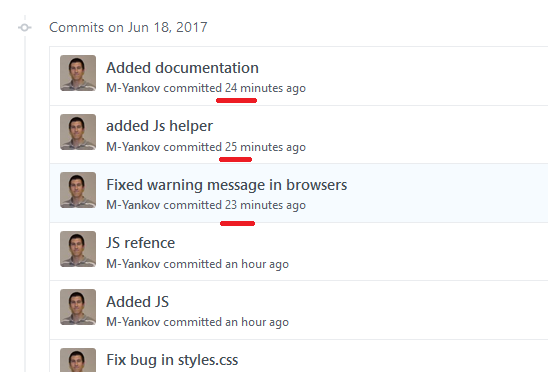

## This is the first version of the program:

Here are the features included in this version:
 - You can convert a mp3 file to any other audio format
 - Most of the other format are convertible to mp3, if not they will show a warning message with details
 - User friendly GUI
 - Report issues is easy with two clicks

There are few bug, that will be fixed in the next release
 - The program is in Not Responding mode while converting 

Authors: 1337@devs.net

#### Sometimes `git rebase` may confuse you

For example check the sequence of the commits: the most recent commit is not on the top 

